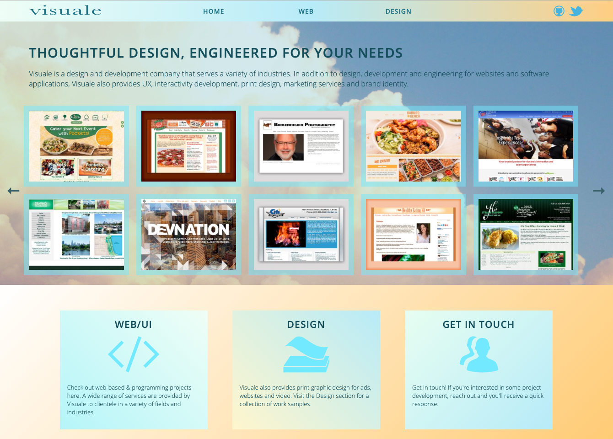
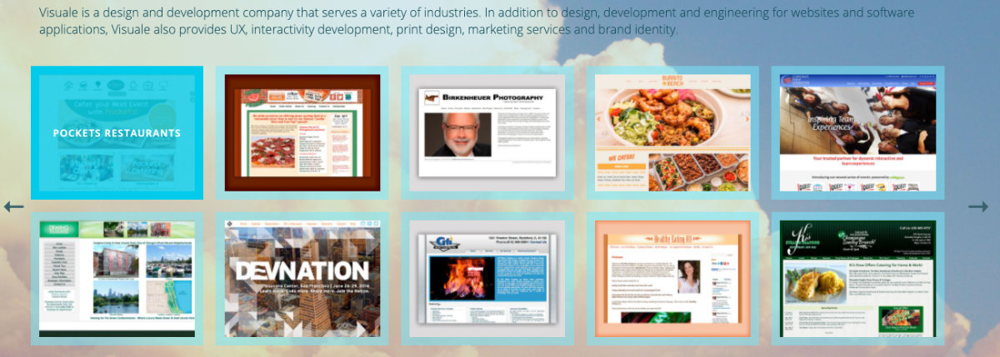

# Visuale Drupal Site Theme Test
This was a site theme I had been working on a while back when I was considering switching the company website from Wordpress to Drupal. I've since gone back to Wordpress but I thought I'd add the theme as a small example of incorporating display modules.



The actual theme contents are located in the directory **/visuale**

## Display Modules
The field types are meant to display as a portfolio of past projects. For the most part, the actual field contents are exposed to the the theme by way of custom modules. One such example is here: <https://github.com/visuale/visuale-slides-module>



Since the modules were designed to work specifically with this theme, all of the JS and CSS (and much of the .twig contents) are stored in the theme itself, but this could just as easily be placed within the specific modules.

Although the modules are designed as Blocks and could be plugged into any portion of the site, some specific regions have been added at **/visuale/visuale.info.yml**

```
[...]
regions:
  header: 'Header'
  content: 'Content'
  footer: 'Footer'
  frontslides: 'Front Slides'
  frontlinkblocks: 'Front Link Blocks'
  webslides: 'Web Slides Section'
  clientroster: 'Client Roster'
  logoslides: 'Logo Slide Area'
  otherdesign: 'Other Design Area'
```

The modules work more or less the same so only one is included as a repo, but that should give an idea of functionality.

I may return to the Drupal version of the site one day but in the meantime, you might find this useful for your own project :-)

